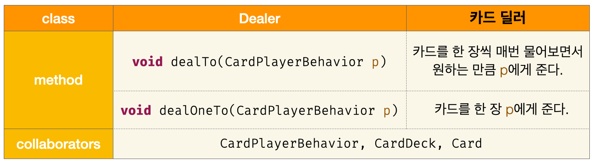
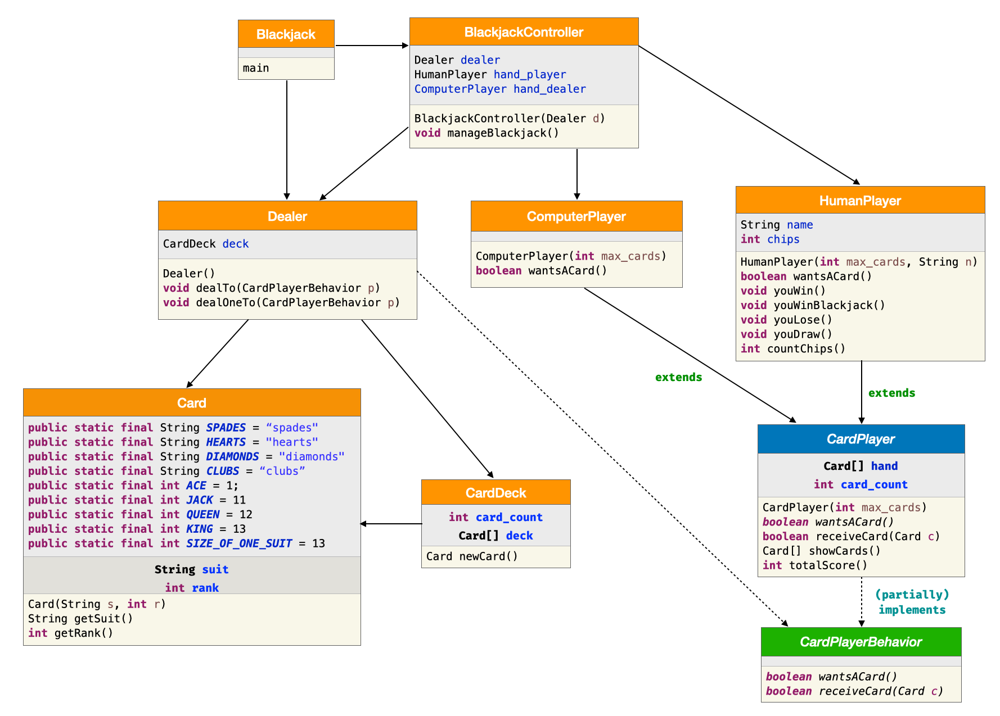

# [CSE2016] 2023년도 가을학기 프로그램설계방법론
## 한양대학교 ERICA 소프트웨어융합대학 인공지능학과

### 실습1 : 상속 이해하기

- 오늘 배운 상속의 개념을 확인해봅시다.

```java
public class Person {
    private String name;

    public Person(String n) {
        name = n;
    }

    public String getName() {
        return name;
    }

    public boolean sameName(Person other) {
        return getName().equals(other.getName();
    }
}

public class PersonFrom extends Person {
    private String city;

    public PersonFrom(String n, String c) {
        super(n);
        city = c;
    }

    public String getCity() {
        return city;
    }

    public boolean same(PersonFrom other) {
        return sameName(other) &&
               city.equals(other.getCity());
    }
}

public class Main {
  public static void main(String[] args) {
    Person p = new Person("마음");
    Person q = new PersonFrom("소리","서울");
    // ...
  }
```

위와 같이 코드가 주어졌을 때, 다음 각 문장을 이해해보자.
Java 컴파일러를 통과하는 문장이 무엇인지 고르고, 실행 결과를 예측해보자.

```java
/* 1 */ System.out.println(p.sameName(q));
/* 2 */ Person x = q; System.out.println(x.getName());
/* 3 */ PersonFrom x = p; System.out.println(x.getCity());
/* 4 */ Person x = q; System.out.println(x.getCity());
/* 5 */ System.out.println(q.same(p));
```

### 실습2 : instanceof 이해하기

- 먼저 앞에서 나온 `IntegerKey`와 `StringKey`를 아래 코드와 같이 동작하도록 수정하자.
- 아래 코드를 실행하면 어떤 결과가 실행창에 프린트 될 지 예측해보자.

```java
Database db = new Database(4);

BankAccount a1 = new BankAccount(50000, new IntegerKey(55));
Key k = new StringKey("열려라");
BankAccount a2 = new BankAccount(10000, k);
boolean transaction1 = db.insert(a1);
boolean transaction2 = db.insert(a2);

Record p = db.find(k);
BankAccount q = (BankAccount)p;
System.out.println(q.getBalance());

Key k = q.getKey();
if (k instanceof IntegerKey)
    System.out.println(((IntegerKey)k).getInt());
else if (k instanceof StringKey)
    System.out.println(((StringKey)k).getString());
else
    System.out.println("모르는 Key 출현 오류");
```

### 실습3 : Dealer 클래스 구현

- 아래 인터페이스를 구현하는 Dealer 클래스를 만들어보자.

```java
public interface CardPlayerBehavior {
  /** wantsACard - 카드 한 장을 받을건지 답한다.
   * @return 카드를 받고 싶으면 true, 아니면 false */
  public boolean wantsACard();

  /** receiveCard - 카드 한 장을 받아서 손에 넣는다.
   * @return 카드를 수령 성공이면 true, 실패이면 false */
  public boolean receiveCard(Card c);
}
```



### 실습4 : Blackjack 클래스 다이어그램 이해하기

- 아래 블랙잭 게임의 클래스 다이어그램을 이해해보자.


