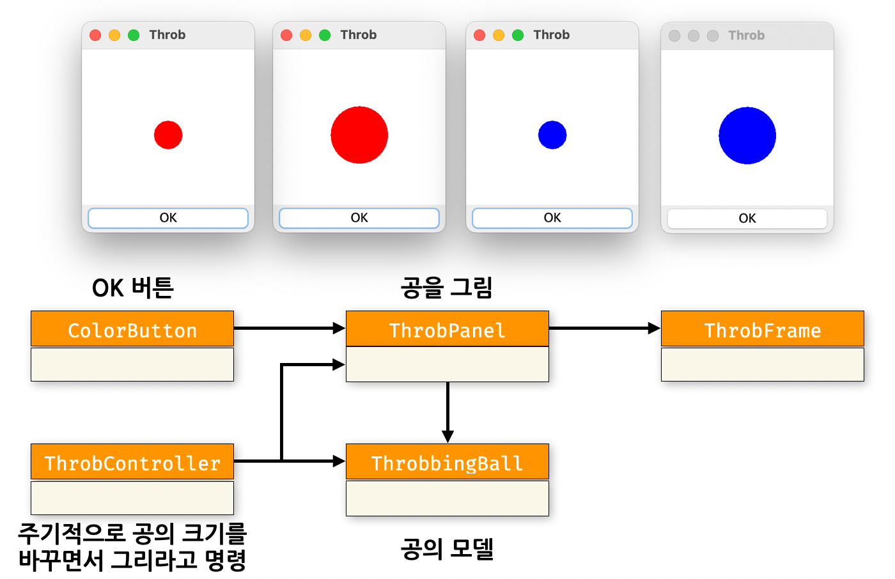
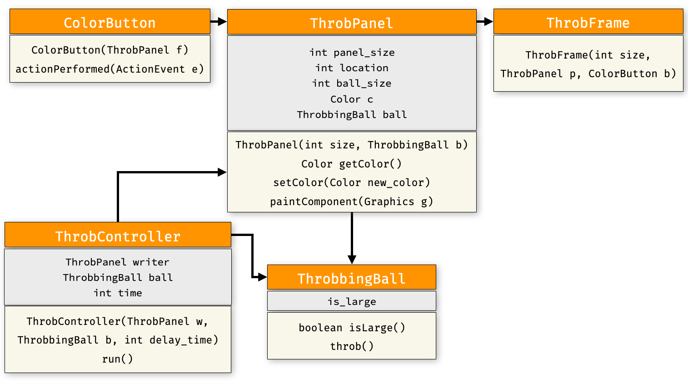
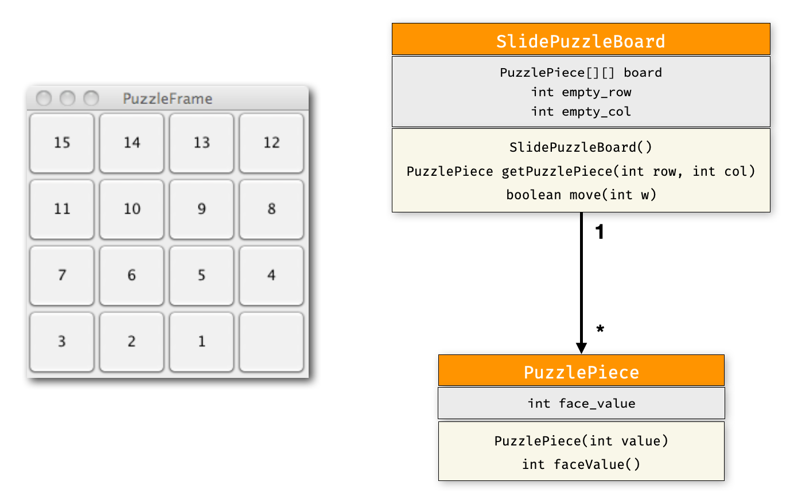
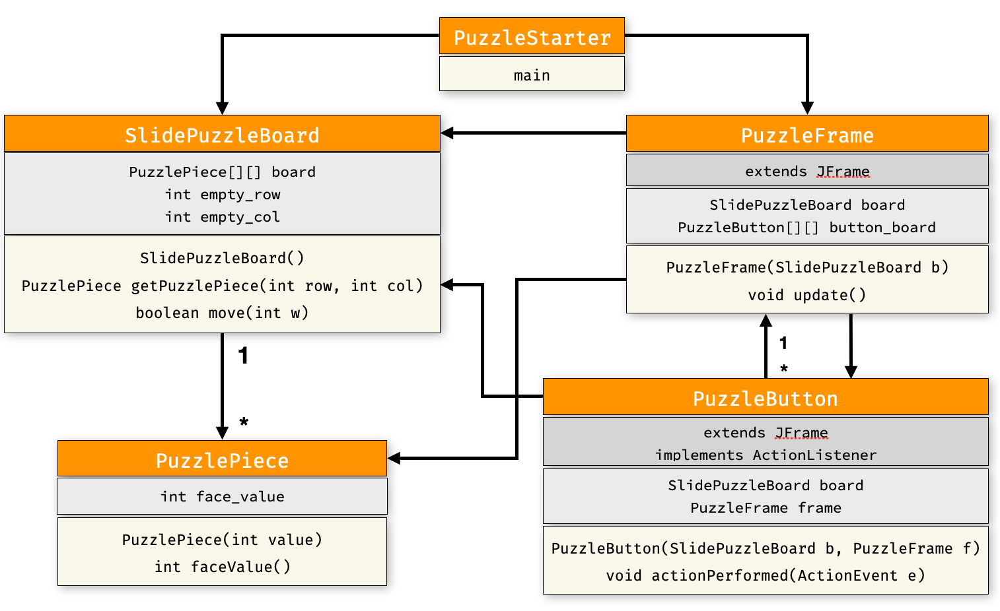
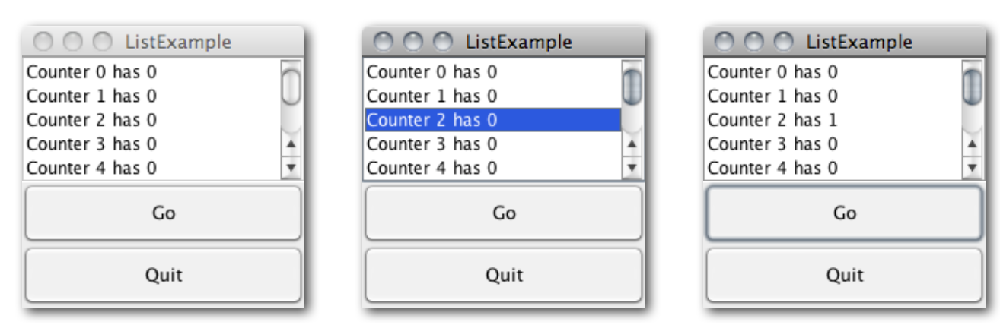
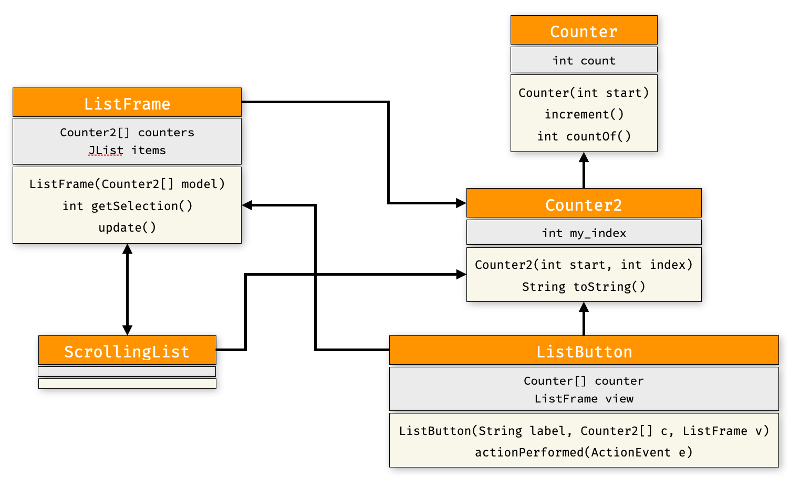

# [CSE2016] 2023년도 가을학기 프로그램설계방법론
## 한양대학교 ERICA 소프트웨어융합대학 인공지능학과

### 실습1 : 크기와 색이 변하는 공

- 오늘 배운 `ActionListener`를 사용해서 크기와 색이 변하는 공을 그려봅시다.

주기적으로 공의 크기를 바꾸고, 버튼을 누르면 색상이 바뀌는 공을 그리세요.
프로그램을 시작하면 주기적으로 공의 크기가 작아졌다 커졌다를 반복합니다.
공은 처음에 빨간색이었다가 OK 버튼을 누를 때마다 파란색과 빨간색으로 바뀌어야 합니다.



전체 코드의 클래스 다이어그램은 아래와 같습니다. `ColorButton`은 오늘 배운 `ActionListener`를
상속받아 사용자가 버튼을 누르는 이벤트에 맞춰 동작합니다.



- `ColorButton` : `actionPerformed(ActionEvent e)` - 이벤트가 발생할 때마다 공의 색상을 바꿉니다.
- `ThrobbingBall` : `throb()` - 공을 크기가 큰지 여부(`is_large`)를 변경합니다.
- `ThrobController` : `run()` - 무조건 반복문으로 `ball`의 크기 여부를 변경하고, `ThrobPanel`을 다시 그린 후(`writer.repaint()`), 정해진 시간만큼 쉽니다(`Thread.sleep(time)`).

### 실습2 : 퍼즐 게임 (GUI 버전)

- 지난 시간에 구현했던 퍼즐 게임을 GUI 버전으로 만들어 봅시다.
아래 그림과 같이 퍼즐 보드의 각 퍼즐 조각(`PuzzlePiece`)을 버튼으로 구현하면 됩니다.



전체 코드의 클래스 다이어그램은 아래와 같습니다. `PuzzleButton`은 오늘 배운 `ActionListener`를
상속받아 사용자가 버튼을 누르는 이벤트에 맞춰 동작합니다.




### 실습3 : 스크롤 리스트 코드 이해하기

- 조교와 함께 스크롤 리스트 코드를 이해해 봅시다.



클래스 다이어그램은 다음과 같습니다.



- `Counter2`는 이론시간에 배웠던 `Counter`를 상속받은 클래스입니다.
다음과 같이 생성자 함수에서 `super`를 호출합니다(`super`는 `Counter`의 생성자함수).
`index`는 현재 `Counter2`의 인덱스 번호를 의미합니다.

```java
    public Counter2(int start, int index) {
        super(start);
        my_index = index;
    }
```

- `Counter2`의 `toString()` 메소드는 스크롤 리스트에 보이는 메시지(counter *index* has *count*) 형태의 문자열을 출력해야 합니다.

- 'ListFrame'의 `getSelection()` 메소드는 현재 리스트(`items`)에서 선택된 아이템의 인데스를 리턴합니다. `JList`에서 제공하는 메소드 `getSelectedIndex()`를 사용하면 됩니다. `getSelectedIndex()`는 선택된 아이템이 없는 경우, `-1`을 리턴합니다.

- 'ListFrame'의 `update()` 메소드는 현재 리스트(`items`)에서 선택된 상태를 취소합니다. `JList`에서 제공하는 메소드 `clearSelection()`를 사용하면 됩니다.

- `ListButton`의 `actionPerformed` 메소드에서 `getSelection`, `update` 메소드를 모두 사용합니다. 리스트에서 선택한 아이템이 있는지 여부에 따라 동작을 달리해야 합니다.

- `ScrollingList.java` 는 다음과 같이 구현합니다. 정해진 수(`how_may_counters` = 8)만큼 `Counter2`를 생성해서 리스트에 담은 후, `ListFrame`을 생성하면 됩니다.

```java
public class ScrollingList {
    public static void main(String[] args) {
        int how_many_counters = 8;
        Counter2[] counters = new Counter2[how_many_counters];
        for (int i = 0; i < how_many_counters; i++)
            counters[i] = new Counter2(0,i);
        new ListFrame(counters);
    }
}
```