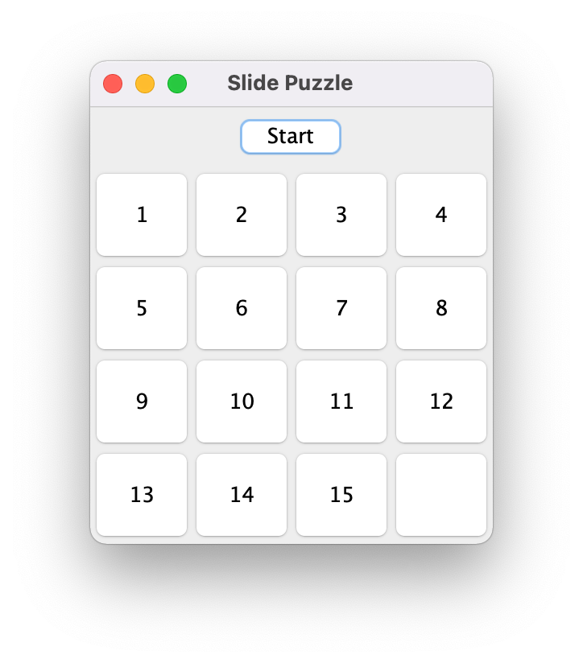
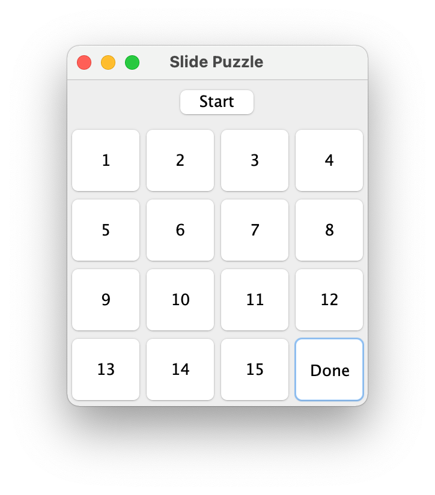
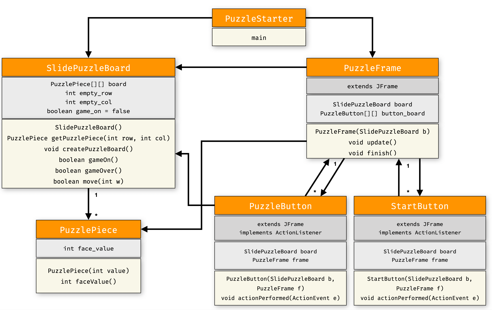

# [CSE2016] 2023년도 가을학기 프로그램설계방법론
## 한양대학교 ERICA 소프트웨어융합대학 인공지능학과

### 실습 : 슬라이드 퍼즐 게임 확장하기

- 지난 시간에 구현했던 GUI 버전의 퍼즐 게임을 다음과 같이 확장해 봅시다.

* 애플리케이션을 실행하면 다음과 같은 퍼즐 보드 창을 띄웁니다.

* `Start` 버튼을 누르면 다음과 같이 우하단 구석에 있는 한칸을 비운 채로 퍼즐 조각을 무작위로 섞은 퍼즐보드가 생기며 퍼즐 게임을 시작합니다. (퍼즐 조각의 배치에 따라 풀 수 없는 경우도 발생)

* 퍼즐 조각을 움직여 퍼즐 보드를 처음과 똑같이 만들면 게임이 끝납니다.

* 퍼즐 보드의 재배치를 완료하면 다음과 같이 우하단 빈 칸에 `Done` 이라고 표시하면서 게임이 끝납니다.
* 게임이 끝나면 어떤 버튼을 누르더라도 퍼즐 조각이 움직이지 않아야 합니다.
* 언제든지 `Start` 버튼을 누르면 다시 처음부터 퍼즐 게임을 할 수 있어야 합니다.

다음 클래스 다이어그램을 참고하면서 코드를 구현해보세요.

